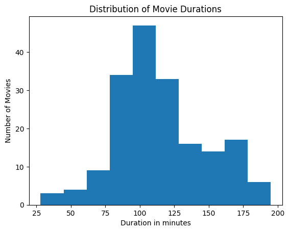
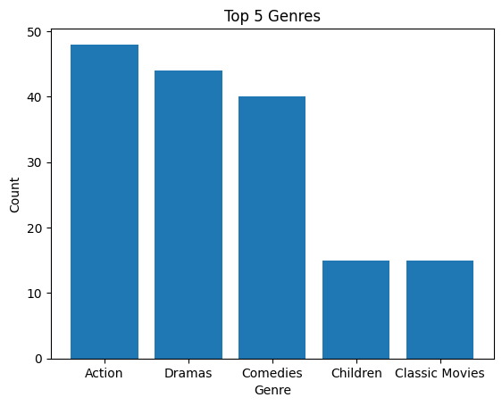
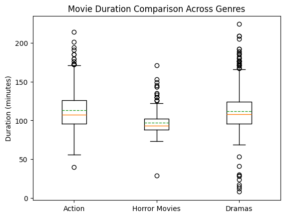
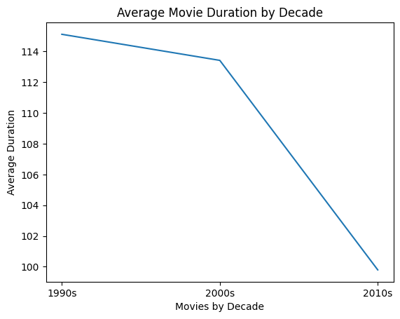
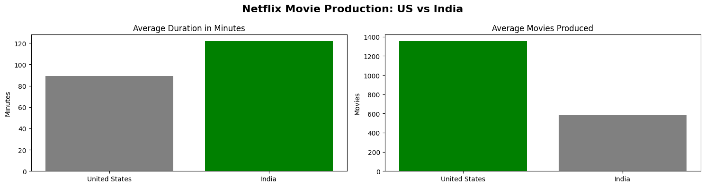
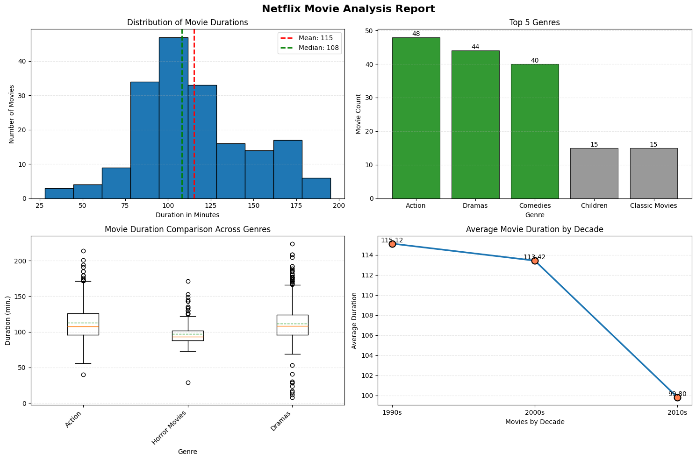

# 📊 Netflix Movie Analysis - Visualizations

This folder contains all the visualizations generated from the Netflix movie dataset analysis.

---

## 1. Distribution of Movie Durations

Shows the frequency distribution of movie lengths in the dataset.

---

## 2. Top 5 Genres

Displays the five most popular genres in the Netflix catalog.

---

## 3. Movie Duration Comparison Across Genres

Compares movie length distributions across different genres using box plots.

---

## 4. Average Movie Duration by Decade

Tracks how average movie duration has changed from the 1990s through the 2010s.

---

## 5. Netflix Movie Production: US vs India

Compares movie production volume and average duration between the United States and India.

---

## 6. Netflix Movie Analysis Report

Comprehensive dashboard showing all key findings in a single view.

---

*Generated as part of the Netflix Movie Analysis project*
